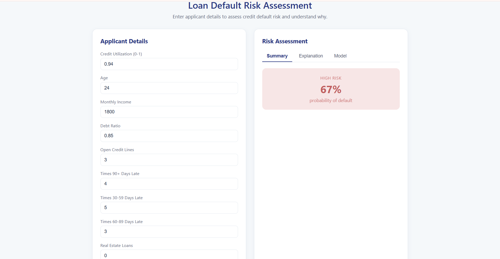
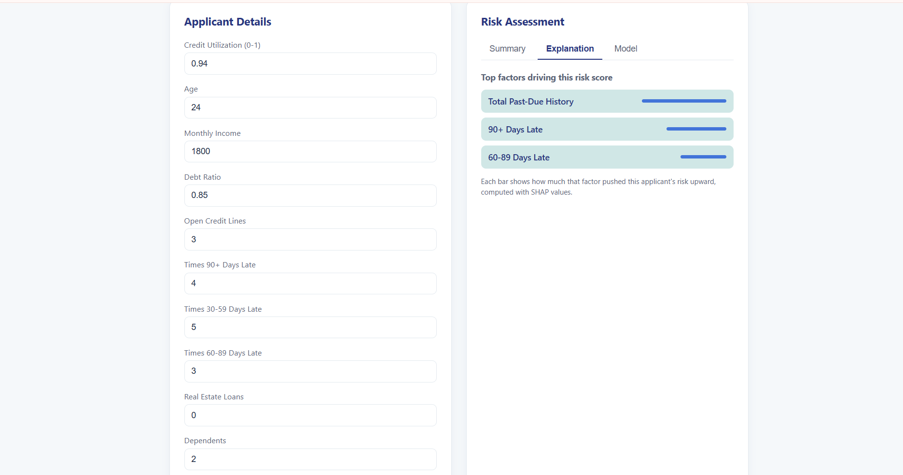

# Explainable Loan Default Risk Scorer

A full-stack machine learning application that predicts the probability a loan applicant will default — and explains *why* for each individual prediction. Built with a Python/scikit-learn model, a FastAPI backend, and a React frontend.

The explainability layer mirrors how real, regulated credit systems must justify their lending decisions (adverse-action requirements), which sets this apart from a standard black-box classifier.

## Screenshots





## What it does

1. A user enters an applicant's financial details (credit utilization, income, debt ratio, payment history, etc.)
2. The trained model returns a **default probability** and a **risk band** (Low / Medium / High)
3. A **SHAP-based explanation** shows the top factors driving that specific applicant's score
4. A model tab surfaces overall performance and the most important risk factors

## Key results

- **ROC-AUC: 0.845** (Random Forest) on a held-out test set
- Trained on **150,000 applicants**
- Handles a realistic **6.7% default rate** (class imbalance), missing data, and outliers
- Top risk drivers: credit utilization, total past-due history, and debt ratio — consistent with real credit logic

## Tech stack

| Layer | Technology |
|---|---|
| Model | Python, scikit-learn (Logistic Regression, Random Forest) |
| Explainability | SHAP |
| Data | pandas, NumPy |
| API | FastAPI (REST) |
| Frontend | React |

## How it works

```
React frontend (applicant form)
        │  POST /predict  (REST API call)
        ▼
FastAPI backend  →  loads trained model + SHAP explainer
        │
        ▼
Returns JSON: risk probability + band + top factors
        │
        ▼
React displays: risk band + SHAP explanation (tabbed view)
```

## Data pipeline & modeling decisions

- **Cleaning:** imputed missing income with the median (robust to the dataset's income outliers), corrected impossible ages, and capped extreme ratio outliers at the 99th percentile rather than dropping rows.
- **Feature engineering:** combined three separate late-payment counts into a single `TotalPastDue` signal, and derived `IncomePerDependent` to capture financial pressure.
- **Imbalance:** used `class_weight="balanced"` and a stratified train/test split, since only 6.7% of applicants default.
- **Evaluation:** prioritized ROC-AUC and recall over accuracy — with an imbalanced target, predicting "no default" for everyone scores 93% accuracy but is useless. Missing a real defaulter (false negative) is far costlier to a lender than a false alarm.
- **Explainability:** SHAP `TreeExplainer` produces per-applicant factor contributions, so every prediction comes with a reason.

## Project structure

```
loan-risk-scorer/
├── data/                  # credit dataset (gitignored)
├── frontend/              # React app
├── data_prep.py           # loading, cleaning, feature engineering
├── train_model.py         # trains and compares models, prints metrics
├── train_and_save.py      # trains and serializes the final model
├── explain.py             # SHAP analysis + summary plot
├── api.py                 # FastAPI REST backend
├── model.pkl              # serialized trained model
└── README.md
```

## Running it locally

**Backend (API):**
```
pip install -r requirements.txt
python train_and_save.py     # creates model.pkl
uvicorn api:app --reload     # serves on http://127.0.0.1:8000
```

**Frontend:**
```
cd frontend
npm install
npm start                    # serves on http://localhost:3000
```

The interactive API docs are available at `http://127.0.0.1:8000/docs`.

## Real-world context

This is a proof-of-concept trained on a public credit dataset (Kaggle "Give Me Some Credit"). Production credit systems extend this pattern with credit-bureau data, automated data ingestion, policy rules layered on top of the model score, and ongoing monitoring for drift and fairness. The explainability implemented here reflects real regulatory requirements for lenders to justify credit decisions.

## Possible extensions

- Threshold tuning to trade off precision vs recall per business cost
- Model monitoring and fairness auditing
- Deployment (containerized API + hosted frontend)